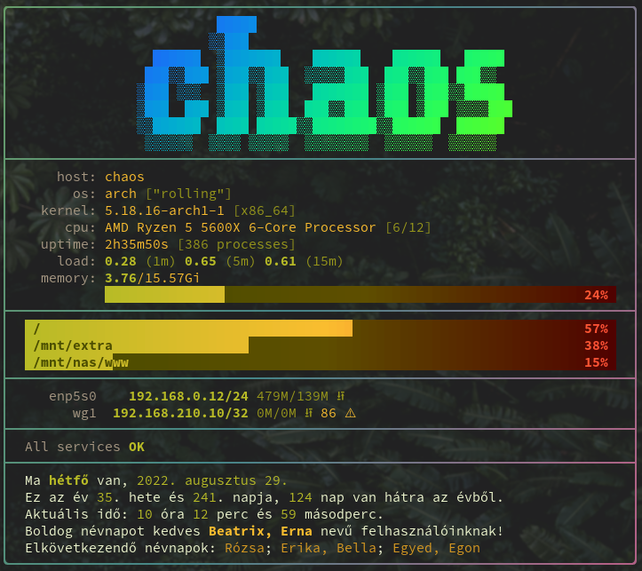

# go-repamotd

Configurable MOTD/sysinfo/fetch.



## Installation

```bash
$ go install github.com/dyuri/go-repamotd@latest
```

> `$GOPATH/bin` should be on your `$PATH`

## Configuration

To create an initial (mostly empty) config file:

```bash
$ go-repamotd -create-config
```

This will create `$XDG_CONFIG_HOME/go-repamotd/config.yaml`  (`$HOME/.config/go-repamotd/config.yml` if `XDG_CONFIG_HOME` is not set).

### Configuration options

**widgets**

List of widgets to use:

- *banner* - display `banner.txt` from the config folder, or the hostname

- *sysinfo* - basic *fetch-like* sysinfo

- *disk* - partition usage

- *network* - network interfaces

- *docker* - docker containers

- *systemd* - failing systemd services

- *naptar* - hungarian calendar (ported from a very old shell script)

**disk**

- *partitions* - list of partitions to show

**net**

- *include/exclude* - network interfaces to include/exclude (e.g. don't show docker ifs)
